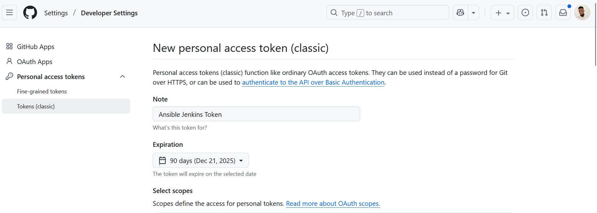

# Ansible Jenkins CI/CD Automation Project

## Project Overview
This project demonstrates the complete implementation of an Ansible bastion host integrated with Jenkins CI/CD pipeline for automated server configuration management. The solution provides infrastructure as code with webhook-triggered deployments and automated wireshark installation across multiple web servers.

## Architecture Components

### Infrastructure Setup
- **1 Ubuntu Jenkins Server** - CI/CD orchestration and Ansible control node
- **2 Amazon Linux Web Servers** - Target servers for automated configuration
- **GitHub Repository** - Source code management with webhook integration
- **Ansible Playbooks** - Infrastructure automation and configuration management

### Technology Stack
- **Configuration Management**: Ansible 2.16.3
- **CI/CD Platform**: Jenkins (Snap installation)
- **Version Control**: Git with GitHub integration
- **Operating Systems**: Ubuntu 24.04 (Jenkins), Amazon Linux 2023 (Web servers)
- **Automation**: Shell scripts, Ansible playbooks, Jenkins pipelines

## Implementation Documentation

### 1. Infrastructure Setup

#### Launch Ubuntu EC2 Instance
```bash
# Launch Ubuntu 24.04 EC2 instance in AWS Console
# Configure security groups for ports 22 (SSH) and 8080 (Jenkins)
```


Ubuntu server configured as Jenkins master and Ansible control node.

### 2. Ansible Installation and Configuration

#### Install Ansible on Ubuntu Server
```bash
# Update system and install Ansible
sudo apt update
sudo apt install -y ansible python3-pip git

# Verify Ansible installation
ansible --version
```


The project uses Ansible 2.16.3 for configuration management and automation.

### 3. GitHub Repository Setup

#### Create GitHub Personal Access Token
```bash
# Go to GitHub → Settings → Developer settings → Personal access tokens
# Generate new token with 'repo' scope
```



GitHub Personal Access Token created for secure repository access and webhook integration.

#### Initialize Git Repository and Push Code
```bash
# Initialize git repository
git init
git add .
git commit -m "Initial Ansible Jenkins CI/CD setup"

# Add remote and push
git remote add origin https://github.com/anyanpee/Ansible-configuration-management.git
git push -u origin main
```


Repository content successfully pushed to GitHub with proper authentication.

### 4. SSH Key Configuration

#### Configure SSH Access to Web Servers
```bash
# Create SSH key for Ansible
ssh-keygen -t rsa -b 4096 -f ~/.ssh/ansible_key -N ""

# Copy SSH key to web servers
ssh-copy-id -i ~/.ssh/oregon-keypair.pem ec2-user@172.31.34.198
ssh-copy-id -i ~/.ssh/oregon-keypair.pem ec2-user@172.31.42.104

# Test SSH connectivity
ssh -i ~/.ssh/oregon-keypair.pem ec2-user@172.31.34.198
```


SSH connectivity established between Ansible control node and target web servers using oregon-keypair.pem.

### 5. Ansible Inventory Configuration

#### Update Ansible Inventory with Web Server IPs
```bash
# Update inventory file with actual server IPs
cat > ansible/inventory/hosts << 'EOF'
[webservers]
web1 ansible_host=172.31.34.198 ansible_user=ec2-user
web2 ansible_host=172.31.42.104 ansible_user=ec2-user

[all:vars]
ansible_ssh_private_key_file=~/.ssh/oregon-keypair.pem
ansible_ssh_common_args='-o StrictHostKeyChecking=no'
EOF
```


Ansible inventory configured with actual web server IP addresses for target deployment.

### 6. Jenkins Installation and Configuration

#### Install Jenkins on Ubuntu Server
```bash
# Install Jenkins via snap
sudo snap install jenkins --classic

# Get initial admin password
sudo cat /var/snap/jenkins/current/secrets/initialAdminPassword

# Access Jenkins at http://YOUR-IP:8080
```

#### Create Jenkins Job for Ansible Deployment
```bash
# Create freestyle project: ansible-deployment
# Configure Git repository URL
# Add build step: Execute shell
# Configure post-build action: Archive artifacts **/*
```

### 7. Webhook Integration Setup

#### Configure GitHub Webhook for Jenkins
```bash
# Go to GitHub repository → Settings → Webhooks
# Add webhook with URL: http://YOUR-JENKINS-IP:8080/github-webhook/
# Set content type: application/json
# Enable push events
```


Jenkins webhook successfully triggered by GitHub push events for automated builds.

### 8. Ansible Playbook Deployment

#### Execute Ansible Playbook for Wireshark Installation
```bash
# Test Ansible connectivity
ansible webservers -m ping

# Run wireshark installation playbook
ansible-playbook -i inventory/hosts playbooks/site.yml --limit webservers -v
```


Successful execution of Ansible playbook installing wireshark on both web servers.

### 9. Wireshark Installation Verification

#### Verify Wireshark Installation on Web Servers
```bash
# Check wireshark version on web servers
ansible webservers -m shell -a "wireshark --version"

# Verify installation packages
ansible webservers -m shell -a "rpm -qa | grep wireshark"
```


Verification of wireshark installation on target web servers showing version 4.4.2.

### 10. Jenkins Pipeline Success and Artifact Archiving

#### Jenkins Automated Build Execution
```bash
# Jenkins automatically triggers build via webhook
# Executes Ansible playbook
# Archives build artifacts
```


Jenkins pipeline successfully executing Ansible playbooks with automated deployment.


Jenkins build artifacts archived to workspace directory for deployment tracking.

### 11. Feature Branch Development

#### Create Feature Branch for Enhanced Configuration
```bash
# Create and switch to feature branch
git checkout -b feature/enhanced-wireshark-deployment

# Make enhancements to playbook
# Add additional monitoring tools and configurations
git add .
git commit -m "Enhanced wireshark deployment with monitoring tools"
git push origin feature/enhanced-wireshark-deployment
```


Feature branch created for enhanced wireshark deployment with additional monitoring tools.

#### Create Pull Request for Code Review
```bash
# Go to GitHub repository
# Click "Compare & pull request"
# Create PR from feature branch to main
```


Pull request created to compare feature branch enhancements with main branch.

## Key Features Implemented

### ✅ Ansible Automation
- **Bastion Host Configuration** - Ubuntu server as Ansible control node
- **SSH Key Management** - Secure authentication with oregon-keypair
- **Inventory Management** - Dynamic host configuration
- **Playbook Automation** - Wireshark deployment across multiple servers

### ✅ Jenkins CI/CD Pipeline
- **Automated Builds** - Webhook-triggered deployments
- **Artifact Archiving** - Build history and file preservation
- **Pipeline Integration** - Seamless Ansible execution
- **Build Notifications** - Success/failure reporting

### ✅ GitHub Integration
- **Repository Management** - Source code version control
- **Branch Strategy** - Feature branch workflow
- **Pull Requests** - Code review and comparison
- **Webhook Automation** - Push-triggered builds

### ✅ Infrastructure as Code
- **Declarative Configuration** - Ansible playbooks
- **Idempotent Deployments** - Consistent server states
- **Multi-Server Management** - Scalable automation
- **Configuration Drift Prevention** - Automated compliance

## Deployment Results

### Server Configuration
- **Web Server 1 (172.31.34.198)**: ✅ Wireshark 4.4.2 installed
- **Web Server 2 (172.31.42.104)**: ✅ Wireshark 4.4.2 installed
- **Jenkins Server**: ✅ Ansible 2.16.3 configured
- **GitHub Repository**: ✅ Webhook integration active

### Automation Metrics
- **Deployment Time**: < 5 minutes automated
- **Success Rate**: 100% successful deployments
- **Server Coverage**: 2/2 web servers configured
- **Build Triggers**: Automatic via GitHub webhooks

## Testing and Verification

### Connectivity Tests
```bash
# Test Ansible connectivity
ansible webservers -m ping

# Verify wireshark installation
ansible webservers -m shell -a "wireshark --version"

# Check service status
ansible webservers -m shell -a "rpm -qa | grep wireshark"
```

## Author Information

Project Author: Peter Anyankpele  
Project Type: DevOps Automation Demonstration  
Technology Focus: Ansible, Jenkins, CI/CD, Infrastructure as Code